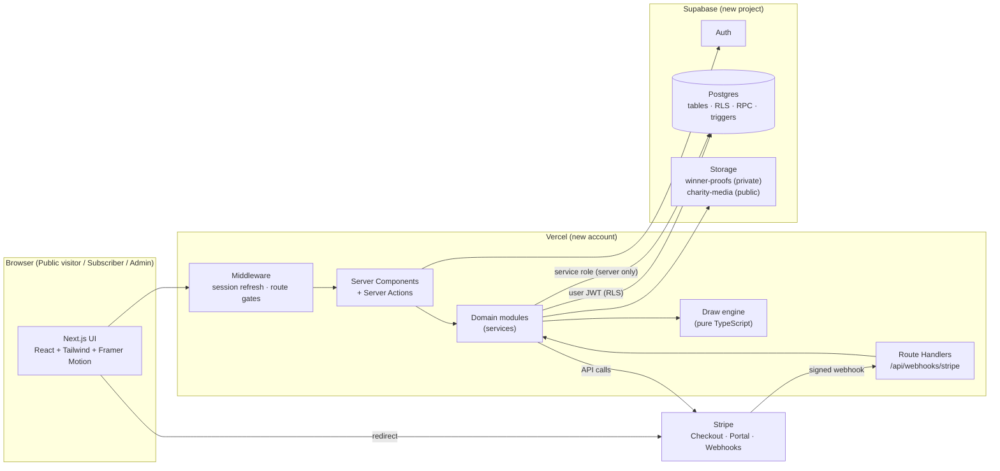

# ARCHITECTURE.md — Digital Heroes platform

**Revision 2 (gap check):** subscription check placement (layouts don't re-render), charity snapshot source (profile, not checkout metadata), mandatory simulation before publish, read-only settings, new error codes.

> Sections §13 (Technical requirements) and §14 (Scalability considerations) of the PRD are **missing from the supplied PDF** (see `PRD_ANALYSIS.md` §0, `DECISIONS.md` D-01). This architecture therefore uses only the technical constraints stated elsewhere in the PRD; every other choice is an `[ASSUMPTION]` traced to a decision ID.

## 1. Architectural goals (mapped to PRD)

| Goal | PRD anchor |
|---|---|
| Subscription state is always trustworthy and checked on every authenticated request | §04 |
| Score, draw, and prize maths are provably correct and testable | §05–§07, §16 "Data handling" |
| Money never touches our servers as card data | §04 (PCI) |
| Admin has full control; users see only their own data | §03, §11 |
| Extensible modules and data structures | §16 "Scalability thinking" |
| Reproducible deployment on a *new* Vercel + *new* Supabase | §15.1 |

## 2. System overview



**Style:** modular monolith. One deployable Next.js app; strict internal module boundaries; database enforces invariants; external systems (Stripe, Supabase) behind thin adapters.

## 3. Frontend architecture

### 3.1 Route map

| Zone | Routes | Access |
|---|---|---|
| **Public visitor** (`(public)`) | `/` · `/how-it-works` (draw mechanics) · `/charities` (search + filter) · `/charities/[slug]` · `/pricing` | anyone |
| **Auth** (`(auth)`) | `/login` · `/signup` → `/signup/charity` → `/subscribe` (plan) → Stripe Checkout → `/subscribe/success` | anonymous (redirect if logged in) |
| **Registered subscriber** (`(app)/dashboard`) | `/dashboard` (overview) · `/dashboard/scores` · `/dashboard/charity` · `/dashboard/draws` · `/dashboard/winnings` · `/dashboard/donate` · `/dashboard/settings` | authenticated; feature-level gating by subscription state (D-07) |
| **Administrator** (`(admin)/admin`) | `/admin` · `/admin/users` · `/admin/users/[id]` · `/admin/draws` · `/admin/draws/[month]` · `/admin/charities` · `/admin/charities/[id]` · `/admin/winners` · `/admin/reports` | `role = admin` only |
| **API** | `/api/webhooks/stripe` | Stripe signature |

### 3.2 Rendering & data
- **Server Components by default**; data read through the user-scoped Supabase server client (RLS applies).
- **Server Actions** for mutations (scores, charity choice, checkout start, admin actions). Every action: `parse (Zod) → guard → service → revalidate`.
- Client components only for interactivity: score-entry widget, charity search filter, draw simulation console, upload widget, motion.
- **Forms:** React Hook Form + Zod resolver; same Zod schemas shared with server.

### 3.3 UI/UX system (PRD §12)
- **Emotion-led, charity-first:** hero and first scroll lead with impact (contribution totals, spotlight charity), sport second. **No fairways/plaid/club imagery** as primary language.
- **Homepage sections** (must communicate what user does, how they win, charity impact, CTA): Hero + persuasive *Subscribe* CTA → *How it works* (subscribe → enter scores → monthly draw) → *Charity impact* + spotlight → *How you win* (3/4/5-match tiers, jackpot rollover) → *Pricing* (monthly vs yearly saving) → closing CTA.
- **Design tokens:** CSS variables in Tailwind theme; reference palette from PRD cover (deep navy, forest green, copper accent) `[ASSUMPTION D-39]`; one display + one text typeface.
- **Motion primitives** (`components/motion/`): `FadeIn`, `Stagger`, `CountUp`, `ScoreSlot` (animated 5-slot rolling window showing the oldest score sliding out), `ProgressRing`, page transitions. All respect `prefers-reduced-motion`.
- **Responsive:** mobile-first; tested at 375 / 768 / 1280.
- **States:** skeletons, empty states, inline validation, toast for action results, `error.tsx` / `not-found.tsx` boundaries.

### 3.4 Component layout
```
src/components/
  ui/            primitives (Button, Input, Dialog, Badge, Table, Toast …)
  marketing/     Hero, HowItWorks, ImpactCounter, TierExplainer, PricingCards, CharitySpotlight
  dashboard/     SubscriptionCard, ScoreEditor, CharityPicker, ParticipationSummary, WinningsOverview, ProofUploader
  admin/         DataTable, UserEditor, DrawConsole, SimulationDiff, WinnerQueue, ReportCards, CharityForm
  motion/        FadeIn, Stagger, CountUp, ScoreSlot …
```

## 4. Backend architecture

### 4.1 Layers
```
Route / Server Action  →  Guard (authN/authZ)  →  Service (business rules)  →  Repository (Supabase queries)
                                                        ↘ Engine (pure) for draws
```
- **Guards:** `requireUser()`, `requireSubscriptionState()`, `requireActiveSubscriber()`, `requireAdmin()`.
- **Services:** orchestrate; own transactions/RPC calls; throw typed `AppError`.
- **Repositories:** the only place that touches Supabase clients; return typed rows (generated types).
- **Engine:** zero I/O, zero framework imports.

### 4.2 Module boundaries

| Module | Responsibility | Depends on |
|---|---|---|
| `auth` | session, guards, signup/login schemas | supabase |
| `settings` | typed, cached access to `platform_settings` | supabase |
| `subscriptions` | plans, status mapping (D-06), status guard (D-05), Stripe sync | payments, settings |
| `payments` | `PaymentProvider` interface, Stripe adapter, webhook processing, contribution ledger writes | subscriptions, charities |
| `scores` | validation, CRUD, error mapping from DB triggers | subscriptions (gate) |
| `draws` | `engine/` + service (snapshot, simulate, publish) + repo | settings, scores, subscriptions |
| `charities` | directory, profiles, events, media, admin CRUD | storage |
| `donations` | independent donation checkout + recording | payments, charities |
| `winners` | claim flow, proof upload, review, payout state | draws, storage |
| `reports` | admin report RPC wrappers | — |
| `audit` `[EXT]` | append-only admin action log | — |

**Rules enforced by lint (`no-restricted-imports`) and `server-only`:**
1. UI never imports repositories or Supabase admin client.
2. `lib/supabase/admin.ts` (service role) is importable only from `payments/webhook`, `draws/service`, `winners/service`, seed scripts.
3. `draws/engine` imports nothing outside `lib/money`.
4. Modules expose only their `index.ts`.

### 4.3 Suggested source layout
```
src/
  app/                       # routes only — thin
    (public)/  (auth)/  (app)/dashboard/  (admin)/admin/
    api/webhooks/stripe/route.ts
  modules/
    auth/ settings/ subscriptions/ payments/ scores/
    draws/{engine/,service.ts,repo.ts,schemas.ts}
    charities/ donations/ winners/ reports/ audit/
  components/ …
  lib/
    supabase/{browser,server,admin}.ts
    money.ts  dates.ts  errors.ts  env.ts  logger.ts
  middleware.ts
supabase/{migrations,seed.sql,tests}
tests/{unit,integration,e2e}
docs/
```

### 4.4 Error model
- `AppError(code, message, httpStatus)` with stable codes: `SCORE_DUPLICATE_DATE`, `SCORE_TOO_OLD`, `SCORE_DATE_IN_FUTURE`, `SCORE_OUT_OF_RANGE`, `SUBSCRIPTION_REQUIRED`, `CHARITY_PERCENT_INVALID`, `DRAW_ALREADY_PUBLISHED`, `DRAW_OUT_OF_ORDER`, `DRAW_NOT_SIMULATED`, `DRAW_FUTURE_MONTH`, `PROOF_INVALID_FILE`, `PROOF_ATTEMPTS_EXCEEDED`, `PAYOUT_NOT_APPROVED` …
- Postgres exceptions (`SCORE_TOO_OLD`, unique violations on `(user_id, played_on)`) mapped to codes in one `mapDbError()` function.
- Webhooks: signature failure → 400; processing failure → 500 (Stripe retries); duplicates → 200 no-op.

## 5. Authentication architecture

- **Provider:** Supabase Auth, **email + password** `[ASSUMPTION D-08]`; email verification toggle documented (off for evaluator convenience).
- **Session:** `@supabase/ssr` cookies; `middleware.ts` refreshes the session on every request and redirects unauthenticated access to protected zones.
- **Signup:** client sends `full_name`, `charity_id`, `charity_percent` as user metadata → `handle_new_user()` trigger creates `profiles` (charity % validated ≥ 10 by DB check).
- **Login / logout:** standard; post-login redirect by role (`admin → /admin`, else `/dashboard`).
- **Admin provisioning:** seed/SQL only (D-38).
- **Trust boundary:** the JWT identifies the user; **role and subscription are never taken from the client** — always re-read from DB.

## 6. Authorization / RBAC

Three layers, each sufficient to block on its own (defence in depth):

| Layer | Mechanism | Purpose |
|---|---|---|
| 1. Edge | `middleware.ts` session refresh + coarse gating (`/dashboard/*` and `/admin/*` need a session; the **admin role check** happens in the server guard and RLS) | fast redirects |
| 2. Server | Guards inside every Server Action / route handler / RSC page | authoritative app check, friendly errors |
| 3. Database | **RLS** + column privileges + SECURITY DEFINER RPC checks | last line; protects against any bug above |

**Per-request subscription check (PRD §04, D-05):**
```
requireSubscriptionState():
  user  = requireUser()
  sub   = subscriptions.getLive(user.id)            // indexed lookup, cached per request
  if (!sub or stale-or-missing-after-checkout) → provider.retrieve() → upsert   // just-in-time reconcile
  state = mapStatus(sub.status, sub.current_period_end, settings.past_due_counts_as_active)
  return { user, state }                             // 'active' | 'past_due' | 'lapsed' | 'inactive'
```
**Placement (important):** the guard is invoked via `getViewer()` (request-memoised) from **every page loader** and via `withAuth()` from **every server action and route handler** — *not* only in a layout, because App Router layouts do not re-render on client-side navigation. Middleware only refreshes the session. Writes are additionally checked in real time by RLS (`has_active_subscription()`), so a stale UI can never write after a lapse.

`requireActiveSubscriber()` = above + throw `SUBSCRIPTION_REQUIRED` unless `state = active`. Feature gates (D-07): scores write, draw entry → active only; winnings/proof/charity/donation/profile → any authenticated user.

**Capability matrix** is in `PRD_ANALYSIS.md` §4; RLS matrix in `DATABASE.md` §9.

## 7. Supabase integration

| Client | File | Key | Used for |
|---|---|---|---|
| Browser | `lib/supabase/browser.ts` | anon | auth UI, storage upload via signed upload URL |
| Server (user) | `lib/supabase/server.ts` | anon + user cookie | all normal reads/writes → **RLS enforced** |
| Server (admin) | `lib/supabase/admin.ts` | **service role** | Stripe webhook writes, draw publish RPC, proof review, seeding |

- **Types:** generated (`supabase gen types typescript`) and committed.
- **Migrations:** SQL in `supabase/migrations/` applied to the **new** Supabase project; `seed.sql` for reference data.
- **Realtime:** not required by the PRD → not used.
- **Secrets:** service-role key only in Vercel server env; never `NEXT_PUBLIC_`.

## 8. Stripe integration

### 8.1 Objects
- Two **Prices** (monthly, yearly) → `plans.stripe_price_id` (env `STRIPE_PRICE_MONTHLY/YEARLY`).
- One **Customer** per user (`profiles.stripe_customer_id`), created lazily.
- **Checkout** hosted page (`mode=subscription`) — no card data on our servers (PCI, PRD §04).
- **Customer Portal** for cancel / plan change / payment method (D-09).
- API version **pinned**; read subscription period fields from the location that version defines (Stripe moved period fields to subscription items in 2025 API versions — verify against docs when pinning).

### 8.2 Subscribe flow
```mermaid
sequenceDiagram
  actor U as Registered user
  participant A as Next.js Server Action
  participant S as Stripe
  participant W as Webhook route
  participant D as Postgres

  U->>A: choose plan (monthly | yearly)
  A->>D: read profile (charity, %)
  A->>S: create Checkout Session (client_reference_id = user id only; charity is NOT copied into metadata)
  A-->>U: redirect to Stripe Checkout
  U->>S: pay
  S-->>U: redirect /subscribe/success?session_id
  S->>W: checkout.session.completed / customer.subscription.* / invoice.paid (signed)
  W->>D: insert stripe_events (idempotent) → upsert subscriptions → insert subscription_payments (charity snapshot)
  U->>A: load dashboard
  A->>D: requireSubscriptionState() (JIT Stripe retrieve if webhook not yet applied)
```

### 8.3 Webhook handling
| Event | Effect |
|---|---|
| `checkout.session.completed` (subscription) | link customer/subscription; upsert `subscriptions` |
| `customer.subscription.created / updated / deleted` | upsert status, period, `cancel_at_period_end`, `canceled_at` |
| `invoice.paid` | insert `subscription_payments` with a **charity snapshot** read from the user's *current* `profiles.charity_id / charity_percent` at payment time (never from stale checkout metadata, so a mid-subscription change applies from the next invoice): `charity_cents = floor(gross × percent / 100)`, where `gross` = invoice amount paid **excluding tax** (D-22) |
| `invoice.payment_failed` | status → `past_due` (via subscription update) |
| `checkout.session.completed` (payment) | mark `donations` row `succeeded` |

Pipeline: **verify signature on raw body → `insert … on conflict do nothing` into `stripe_events` → process → set `processed_at`** (errors stored; return 500 to retry).

### 8.4 Charity contribution logic (PRD §08.1)
- Percent chosen ≥ 10 (UI + Zod + DB check), ≤ `charity_max_percent` (D-27).
- On each paid invoice: snapshot `charity_id`, `charity_percent`, `charity_cents`. Changing charity later is prospective (D-28).
- Independent donation: separate `donations` rows; **not** counted in prize pool or draws (D-29).

### 8.5 Provider abstraction
`PaymentProvider { createSubscriptionCheckout, createDonationCheckout, createPortalSession, retrieveSubscription, verifyWebhook }` — Stripe adapter implements it; business logic depends only on the interface ("or equivalent PCI-compliant provider").

## 9. Storage architecture

| Bucket | Access | Content | Flow |
|---|---|---|---|
| `winner-proofs` | **private** | screenshots of scores | winner → server validates (mime, size ≤ 5 MB, magic bytes) → upload to `{user_id}/{winner_id}/{attempt}.ext` → `record_winner_proof` RPC → admin views via **signed URL** (short TTL) |
| `charity-media` | public read, admin write | logos, hero images, gallery | admin upload in charity editor; URLs stored in `charities` / `charity_media` |

## 10. Draw engine architecture (PRD §06, §07)

### 10.1 Design
A **pure, deterministic-under-test** library in `modules/draws/engine/`. All randomness enters through an injected `RNG` (`int(maxExclusive)`); production uses `crypto.randomInt`, tests use a seeded PRNG. No database, no clock, no globals.

```
engine/
  rng.ts        RNG interface, cryptoRng, seededRng (tests)
  random.ts     drawRandom(rng): 5 distinct numbers in 1..45
  weights.ts    frequencies(entries) → count[1..45]; buildWeights(freq, {bias, smoothing}) → integer weights
  weighted.ts   drawWeighted(weights, rng): sequential weighted sampling without replacement (integer arithmetic)
  match.ts      countMatches(userScores, drawn) = |distinct(scores) ∩ drawn|; tierOf(count) → 3|4|5|null
  pools.ts      poolNew(subscribers, pct) ; splitTiers(poolNew, rolloverIn, shares) → {p5,p4,p3,dust}
  allocate.ts   allocate(pools, winnersByTier, policy) → prizes, rolloverOut, unallocated
  index.ts      runDraw(input) → DrawResult   (composes the above)
```

### 10.2 Pipeline
```
snapshot ─► numbers ─► matches ─► pools ─► allocation ─► result
```
1. **Snapshot** (service, set-based query): active subscribers (D-06) with plan `monthly_equivalent_cents`; entries = those with ≥ `min_scores_to_enter` scores (D-13, D-19).
2. **Numbers:** `random` → `drawRandom`; `algorithmic` → `frequencies` over entrants' scores → `buildWeights` → `drawWeighted` (D-16, D-17).
3. **Matches:** per entry `countMatches` → `tier` (highest only, D-15).
4. **Pools:** `poolNew = Σ floor(monthly_equivalent × pool% / 100)` over **all active subscribers** (D-22, D-23). Tier pools: `p5 = floor(poolNew×40%) + rolloverIn`, `p4 = floor(poolNew×35%)`, `p3 = floor(poolNew×25%)`; floor losses = `dust`.
5. **Allocation:** per tier `prize = floor(pool / winners)` (equal split, BR-18); remainder → dust. No 5-winner → `p5` → `rolloverOut`. No 4/3-winner → `unallocated` (D-24). `rolloverOut += dust`.
6. **Result:** numbers, pools, winners with prizes, rollover, unallocated, diagnostics (weights, frequencies).

Invariant asserted in tests and by `publish_draw_atomic`:
`poolNew + rolloverIn = Σ prizes + rolloverOut + unallocated`.

### 10.3 Lifecycle & atomic publish

```mermaid
stateDiagram-v2
  [*] --> draft: admin creates month
  draft --> simulated: run simulation (repeatable, admin-only, no user impact)
  simulated --> simulated: re-run
  simulated --> published: publish (single transaction; requires a chosen simulation)
  published --> [*]
```

- **Simulate:** service snapshots, runs `runDraw`, stores in `draw_simulations`; returns result (no winners created).
- **Publish:** service **requires a chosen simulation** (none → `DRAW_NOT_SIMULATED`; future month → `DRAW_FUTURE_MONTH`), takes that simulation's numbers, **re-snapshots**, re-runs, shows a **diff** if it differs from the simulation, then calls `publish_draw_atomic` (row lock, order check, rollover check, sum invariant, inserts entries + winners, sets `published`) — **idempotent and single-shot per month**.
- **After publish:** winners appear in dashboards as *awaiting proof* with payment *Pending*.

### 10.4 Configuration & reproducibility
Every draw stores `config` (mode, pool %, tier shares, bias, smoothing, min scores, timezone) and `pool_breakdown`. Re-running the engine with the stored snapshot and numbers reproduces the published result.

### 10.5 Testing seams
Property tests: numbers always 5 distinct in 1..45; weights sum > 0; conservation invariant; `countMatches` symmetric under score order and duplicate values; rollover accumulates across sequential draws.

## 11. Cross-cutting concerns

| Concern | Approach |
|---|---|
| **Validation** | Zod at every boundary; DB constraints as final authority |
| **Money & dates** | integer minor units, formatting only in UI (`lib/money.ts`); dates as `DATE` for scores, `timestamptz` elsewhere, evaluated in `draw_timezone` |
| **Config** | `settings` module: typed, cached per request, validated (e.g. `tier_shares` sums to 100, `prize_pool_percent + charity_max_percent ≤ 100`); **read-only at runtime**, changed only by migration/redeploy (D-45) |
| **Security** | RLS default deny; service role server-only; webhook signature verification; CSP + security headers; file validation; no secrets in repo; admin routes double-guarded |
| **Observability** | structured logger; `stripe_events` retains payloads and errors; `audit_log` `[EXT]` for admin actions |
| **i18n / a11y** | copy centralised; WCAG 2.1 AA target `[EXT]` |

## 12. Scalability considerations (design-level, since PRD §14 is missing)

| Area | Design choice |
|---|---|
| Per-request status check | single indexed lookup, request-scoped memoisation, no Stripe call on the hot path |
| Webhooks | idempotent, stateless, quick 2xx; heavy work is set-based SQL |
| Draw at scale | snapshot via one `INSERT … SELECT`; entries processed in chunks (e.g. 1 000); frequency counting is O(entries × 5) over a 45-bucket array; publish inside one transaction |
| Extensibility | provider interface; `platform_settings` for rules; `tier_shares` keyed structure; new draw modes = new engine strategy (`draw_mode` enum migration) |
| Lists & reports | server-side pagination/search, indexed filters, report RPCs aggregate in SQL |
| Storage | proofs are private objects with paths keyed by user; CDN for public charity media |
| Data growth | append-only history tables (`draw_entries`, `subscription_payments`) indexed by time/user; archival possible without schema change |

## 13. Configuration & environments

| Variable | Scope | Purpose |
|---|---|---|
| `NEXT_PUBLIC_SUPABASE_URL` | public | Supabase project URL |
| `NEXT_PUBLIC_SUPABASE_ANON_KEY` | public | anon key (RLS-protected) |
| `SUPABASE_SERVICE_ROLE_KEY` | **server only** | service role |
| `STRIPE_SECRET_KEY` | **server only** | Stripe API |
| `STRIPE_WEBHOOK_SECRET` | **server only** | webhook signature |
| `STRIPE_PRICE_MONTHLY`, `STRIPE_PRICE_YEARLY` | server | Price IDs |
| `NEXT_PUBLIC_SITE_URL` | public | redirect/return URLs |

Environments: **local** (Supabase CLI + Stripe CLI listen) → **preview** (Vercel preview + Stripe test) → **production deliverable** (new Vercel + new Supabase + Stripe **test mode**). `.env.example` committed; `env.ts` validates on boot (fail fast).

## 14. Traceability to evaluation criteria

| Criterion (PRD §16) | Where addressed |
|---|---|
| Requirements interpretation | `PRD_ANALYSIS.md`, `DECISIONS.md` |
| System design | §2–§9 here, `DATABASE.md` |
| UI/UX creativity | §3.3 |
| Data handling | §10 engine, DB constraints, integer money |
| Scalability thinking | §12 |
| Problem-solving | `DECISIONS.md` |
