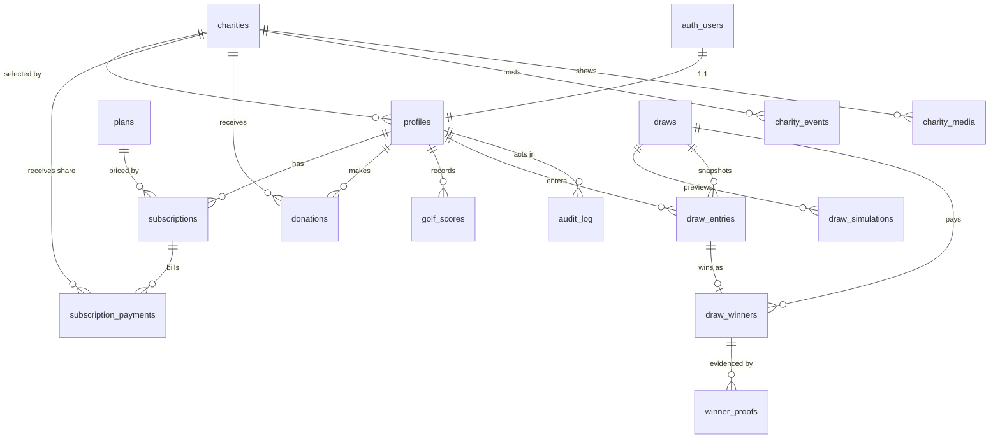

# DATABASE.md — Schema, constraints, indexes, RLS

**Revision 2 (gap check):** removed the unique "one live subscription" index (could wedge webhooks); publish now requires a simulation (`published_simulation_id`); `platform_settings` is read-only to clients; proof uploads are server-mediated; added `published_draw_results()`; seed guidance for the test subscriber.

Target: **Supabase Postgres** (new project, per PRD §15.1). The DDL below is the **reference design**; the executable version lives in `supabase/migrations/` (see IMPLEMENTATION_PLAN Phase 1). Decision IDs (`D-nn`) point to `DECISIONS.md`.

## 1. Design principles

1. **Rules live in the database** where they must never be bypassed: 1–45 score range, one score per date, 5-score rolling window, min 10 % charity, `paid ⇒ approved`, unique draw per month.
2. **Money is `integer`/`bigint` minor units** (paise/cents). No floats. `currency` stored alongside.
3. **History is immutable**: draws snapshot config, entries snapshot scores, payments snapshot charity % → later edits never rewrite the past.
4. **Client vs server writes**: end-user clients write only profile fields, own scores, and proof uploads. Payments, subscriptions, draws, winners are written by **service role / SECURITY DEFINER RPCs**.
5. **Configuration in data**: `platform_settings` (D-settings registry) rather than constants.

## 2. Entity-relationship overview



## 3. Types

```sql
create extension if not exists pgcrypto;
create extension if not exists citext;

create type user_role           as enum ('subscriber', 'admin');
create type billing_interval    as enum ('month', 'year');
create type subscription_status as enum
  ('incomplete','active','past_due','canceled','unpaid','incomplete_expired');  -- mirrors Stripe (D-06)
create type draw_mode           as enum ('random', 'algorithmic');               -- PRD §06
create type draw_status         as enum ('draft', 'simulated', 'published');
create type verification_status as enum
  ('awaiting_proof','pending_review','approved','rejected');                     -- D-32
create type payment_status      as enum ('pending', 'paid');                     -- PRD §09: Pending → Paid
create type donation_status     as enum ('pending', 'succeeded', 'failed');
```

## 4. Tables

### 4.1 Configuration

```sql
create table platform_settings (
  key         text primary key,
  value       jsonb not null,
  description text,
  updated_by  uuid,                          -- FK added after profiles
  updated_at  timestamptz not null default now()
);
```
Keys: see `DECISIONS.md` → *Settings registry* (`prize_pool_percent`, `tier_shares`, `min_scores_to_enter`, `algorithm_bias`, …).

### 4.2 Charities (PRD §08)

```sql
create table charities (
  id                uuid primary key default gen_random_uuid(),
  slug              text not null unique check (slug ~ '^[a-z0-9]+(-[a-z0-9]+)*$'),
  name              text not null,
  short_description text not null,
  description       text not null,
  category          text,                                  -- directory filter (D-30)
  logo_url          text,
  hero_image_url    text,
  website_url       text,
  is_featured       boolean not null default false,        -- homepage spotlight
  featured_order    integer,
  is_active         boolean not null default true,
  archived_at       timestamptz,                           -- soft delete (D-30)
  created_at        timestamptz not null default now(),
  updated_at        timestamptz not null default now()
);

create table charity_events (                              -- "upcoming events such as golf days"
  id           uuid primary key default gen_random_uuid(),
  charity_id   uuid not null references charities(id) on delete cascade,
  title        text not null,
  description  text,
  starts_at    timestamptz not null,
  location     text,
  image_url    text,
  is_published boolean not null default true,
  created_at   timestamptz not null default now()
);

create table charity_media (                               -- "images" / "manage content and media"
  id           uuid primary key default gen_random_uuid(),
  charity_id   uuid not null references charities(id) on delete cascade,
  storage_path text not null,
  alt_text     text not null default '',
  sort_order   integer not null default 0
);
```

### 4.3 Profiles (PRD §03)

```sql
create table profiles (
  id                 uuid primary key references auth.users(id) on delete cascade,
  email              citext not null unique,
  full_name          text not null,
  role               user_role not null default 'subscriber',          -- D-38
  charity_id         uuid references charities(id) on delete restrict,
  charity_percent    numeric(4,1) not null default 10.0
                     check (charity_percent >= 10.0 and charity_percent <= 100.0), -- PRD hard floor
  stripe_customer_id text unique,
  created_at         timestamptz not null default now(),
  updated_at         timestamptz not null default now()
);
alter table platform_settings
  add constraint platform_settings_updated_by_fk foreign key (updated_by) references profiles(id);
```

### 4.4 Plans, subscriptions, payments (PRD §04)

```sql
create table plans (
  id                       uuid primary key default gen_random_uuid(),
  code                     text not null unique check (code in ('monthly','yearly')),
  name                     text not null,
  billing_interval         billing_interval not null,
  price_cents              integer not null check (price_cents > 0),
  currency                 char(3) not null default 'INR',
  stripe_price_id          text unique,
  is_active                boolean not null default true,
  -- monthly equivalent for prize-pool maths (D-23); integer division floors
  monthly_equivalent_cents integer generated always as
    (case when billing_interval = 'month' then price_cents else price_cents / 12 end) stored
);
create unique index plans_one_active_per_interval on plans (billing_interval) where is_active;

create table subscriptions (
  id                     uuid primary key default gen_random_uuid(),
  user_id                uuid not null references profiles(id) on delete cascade,
  plan_id                uuid not null references plans(id),
  stripe_subscription_id text not null unique,
  stripe_customer_id     text not null,
  status                 subscription_status not null,
  current_period_start   timestamptz,
  current_period_end     timestamptz,                -- the "renewal date" (PRD §10)
  cancel_at_period_end   boolean not null default false,
  canceled_at            timestamptz,
  created_at             timestamptz not null default now(),
  updated_at             timestamptz not null default now()
);
-- "live" = active | past_due. Deliberately NOT a unique index: a duplicate (e.g. user double-paid)
-- must never make a webhook upsert fail forever. The app refuses a second checkout while a live
-- subscription exists (D-06); getLiveSubscription() picks the latest by current_period_end.
create index subscriptions_user_status_idx on subscriptions (user_id, status, current_period_end desc);

create table stripe_events (                          -- webhook idempotency
  id           text primary key,                      -- Stripe event id (evt_…)
  type         text not null,
  payload      jsonb not null,
  received_at  timestamptz not null default now(),
  processed_at timestamptz,
  error        text
);

create table subscription_payments (                  -- one row per paid invoice; drives charity totals
  id                uuid primary key default gen_random_uuid(),
  user_id           uuid not null references profiles(id) on delete restrict,
  subscription_id   uuid references subscriptions(id) on delete set null,
  stripe_invoice_id text not null unique,
  gross_cents       integer not null check (gross_cents >= 0),
  currency          char(3) not null,
  charity_id        uuid references charities(id) on delete restrict,   -- snapshot (D-28)
  charity_percent   numeric(4,1) not null check (charity_percent >= 10.0),
  charity_cents     integer not null check (charity_cents >= 0 and charity_cents <= gross_cents),
  paid_at           timestamptz not null,
  created_at        timestamptz not null default now()
);

create table donations (                              -- independent donation, not tied to gameplay (D-29)
  id                         uuid primary key default gen_random_uuid(),
  user_id                    uuid references profiles(id) on delete set null,
  charity_id                 uuid not null references charities(id) on delete restrict,
  amount_cents               integer not null check (amount_cents > 0),
  currency                   char(3) not null,
  status                     donation_status not null default 'pending',
  stripe_checkout_session_id text unique,
  stripe_payment_intent_id   text unique,
  created_at                 timestamptz not null default now(),
  completed_at               timestamptz
);
```

### 4.5 Scores (PRD §05)

```sql
create table golf_scores (
  id         uuid primary key default gen_random_uuid(),
  user_id    uuid not null references profiles(id) on delete cascade,
  score      smallint not null check (score between 1 and 45),        -- Stableford 1–45
  played_on  date not null,                                           -- each score includes a date
  created_at timestamptz not null default now(),
  updated_at timestamptz not null default now(),
  unique (user_id, played_on)                                         -- one entry per date
);
create index golf_scores_user_recent_idx on golf_scores (user_id, played_on desc, created_at desc);
```

**Rolling-window enforcement** (race-safe, D-10/D-11):

```sql
create function enforce_score_rules() returns trigger
language plpgsql security definer set search_path = public as $$
declare
  retained int  := coalesce((select (value)::int from platform_settings where key = 'score_retained_count'), 5);
  policy   text := coalesce((select value #>> '{}' from platform_settings where key = 'backdated_score_policy'), 'reject');
  tz       text := coalesce((select value #>> '{}' from platform_settings where key = 'draw_timezone'), 'Asia/Kolkata');
  cnt int; oldest date;
begin
  perform pg_advisory_xact_lock(hashtextextended(new.user_id::text, 0));   -- serialise per user
  if new.played_on > (now() at time zone tz)::date then
    raise exception 'SCORE_DATE_IN_FUTURE' using errcode = 'P0001';
  end if;
  if tg_op = 'INSERT' then
    select count(*), min(played_on) into cnt, oldest from golf_scores where user_id = new.user_id;
    if cnt >= retained and new.played_on < oldest and policy = 'reject' then
      raise exception 'SCORE_TOO_OLD' using errcode = 'P0001';
    end if;
  end if;
  new.updated_at := now();
  return new;
end $$;
create trigger golf_scores_rules before insert or update on golf_scores
  for each row execute function enforce_score_rules();

create function trim_scores_to_window() returns trigger
language plpgsql security definer set search_path = public as $$
declare retained int := coalesce((select (value)::int from platform_settings where key = 'score_retained_count'), 5);
begin
  delete from golf_scores
   where user_id = new.user_id
     and id not in (select id from golf_scores where user_id = new.user_id
                    order by played_on desc, created_at desc limit retained);   -- new score replaces the oldest
  return null;
end $$;
create trigger golf_scores_trim after insert on golf_scores
  for each row execute function trim_scores_to_window();
```

### 4.6 Draws (PRD §06, §07)

```sql
create function is_valid_draw_numbers(nums smallint[]) returns boolean
language sql immutable as $$
  select nums is null or (
    cardinality(nums) = 5
    and (select count(distinct n) = 5 and bool_and(n between 1 and 45) from unnest(nums) n)
  );
$$;

create table draws (
  id                       uuid primary key default gen_random_uuid(),
  draw_month               date not null unique
                           check (draw_month = date_trunc('month', draw_month)::date),   -- monthly cadence
  mode                     draw_mode not null,                                            -- random | algorithmic
  status                   draw_status not null default 'draft',
  config                   jsonb not null default '{}'::jsonb,   -- snapshot of settings used (D-17, D-22)
  drawn_numbers            smallint[] check (is_valid_draw_numbers(drawn_numbers)),
  active_subscriber_count  integer check (active_subscriber_count >= 0),
  entry_count              integer check (entry_count >= 0),
  pool_breakdown           jsonb,                                -- e.g. {"monthly":{"count":10,"each_cents":24950},…}
  pool_new_cents           bigint check (pool_new_cents >= 0),   -- fresh contributions this month
  rollover_in_cents        bigint not null default 0 check (rollover_in_cents >= 0),
  pool_total_cents         bigint check (pool_total_cents >= 0), -- new + rollover_in
  pool_5_cents             bigint check (pool_5_cents >= 0),     -- 40 % + rollover_in (jackpot)
  pool_4_cents             bigint check (pool_4_cents >= 0),     -- 35 %
  pool_3_cents             bigint check (pool_3_cents >= 0),     -- 25 %
  rollover_out_cents       bigint check (rollover_out_cents >= 0),  -- unclaimed jackpot + dust (D-25, D-26)
  unallocated_cents        bigint check (unallocated_cents >= 0),   -- unwon 4/3 tiers (D-24)
  published_at             timestamptz,
  published_by             uuid references profiles(id),
  published_simulation_id  uuid,                                  -- FK added below; PRD: simulation before publish
  created_by               uuid references profiles(id),
  created_at               timestamptz not null default now(),
  updated_at               timestamptz not null default now(),
  check (status <> 'published' or (drawn_numbers is not null and published_at is not null
         and pool_total_cents is not null and rollover_out_cents is not null
         and published_simulation_id is not null))                 -- cannot publish without a simulation
);

create table draw_simulations (                      -- admin-only previews (PRD: "Simulation before publish")
  id            uuid primary key default gen_random_uuid(),
  draw_id       uuid not null references draws(id) on delete cascade,
  mode          draw_mode not null,
  config        jsonb not null,
  drawn_numbers smallint[] not null check (is_valid_draw_numbers(drawn_numbers)),
  result        jsonb not null,                        -- entries, tier counts, per-tier prizes, rollover
  created_by    uuid references profiles(id),
  created_at    timestamptz not null default now()
);

alter table draws add constraint draws_published_simulation_fk
  foreign key (published_simulation_id) references draw_simulations(id);

create table draw_entries (                          -- "draws entered"; snapshot of scores at draw time (D-19)
  id          uuid primary key default gen_random_uuid(),
  draw_id     uuid not null references draws(id) on delete restrict,
  user_id     uuid not null references profiles(id) on delete restrict,
  scores      smallint[] not null check (cardinality(scores) between 1 and 5),
  match_count smallint not null default 0 check (match_count between 0 and 5),
  tier        smallint check (tier in (3,4,5)),
  created_at  timestamptz not null default now(),
  unique (draw_id, user_id),
  check (tier is not distinct from (case when match_count >= 3 then match_count end))   -- highest tier only (D-15)
);
```

### 4.7 Winners & verification (PRD §09)

```sql
create table draw_winners (
  id                  uuid primary key default gen_random_uuid(),
  draw_id             uuid not null references draws(id) on delete restrict,
  entry_id            uuid not null unique references draw_entries(id) on delete restrict,
  user_id             uuid not null references profiles(id) on delete restrict,
  tier                smallint not null check (tier in (3,4,5)),
  prize_cents         bigint not null check (prize_cents >= 0),        -- equal split within tier (D-26)
  verification_status verification_status not null default 'awaiting_proof',
  proof_attempts      smallint not null default 0 check (proof_attempts >= 0),
  review_note         text,
  reviewed_by         uuid references profiles(id),
  reviewed_at         timestamptz,
  payment_status      payment_status not null default 'pending',       -- Pending → Paid
  paid_at             timestamptz,
  paid_by             uuid references profiles(id),
  created_at          timestamptz not null default now(),
  updated_at          timestamptz not null default now(),
  unique (draw_id, user_id),
  check (payment_status <> 'paid' or verification_status = 'approved'),      -- cannot pay unverified
  check ((payment_status = 'paid') = (paid_at is not null))
);

create table winner_proofs (                         -- screenshot of scores from the golf platform
  id           uuid primary key default gen_random_uuid(),
  winner_id    uuid not null references draw_winners(id) on delete cascade,
  attempt_no   smallint not null check (attempt_no >= 1),
  storage_path text not null,                        -- private bucket path
  mime_type    text not null check (mime_type in ('image/png','image/jpeg','image/webp')),
  size_bytes   integer not null check (size_bytes > 0 and size_bytes <= 5242880),
  uploaded_at  timestamptz not null default now(),
  unique (winner_id, attempt_no)
);
```

### 4.8 Audit `[EXT]` (D-41)

```sql
create table audit_log (
  id          bigint generated always as identity primary key,
  actor_id    uuid references profiles(id),
  action      text not null,                  -- e.g. 'draw.publish', 'winner.approve', 'score.admin_edit'
  entity_type text not null,
  entity_id   text not null,
  before_data jsonb,
  after_data  jsonb,
  created_at  timestamptz not null default now()
);
```

## 5. Relationships (summary)

| Child | FK → Parent | On delete | Notes |
|---|---|---|---|
| `profiles.id` | `auth.users.id` | cascade | 1:1, created by trigger on signup |
| `profiles.charity_id` | `charities.id` | restrict | archive instead of delete |
| `subscriptions.user_id` | `profiles.id` | cascade | |
| `subscriptions.plan_id` | `plans.id` | no action | |
| `subscription_payments.user_id / charity_id` | `profiles` / `charities` | restrict | financial history kept |
| `donations.user_id` | `profiles.id` | set null | donation record survives |
| `charity_events`, `charity_media` | `charities.id` | cascade | |
| `golf_scores.user_id` | `profiles.id` | cascade | personal data |
| `draw_simulations.draw_id` | `draws.id` | cascade | previews disposable |
| `draw_entries.draw_id / user_id` | `draws` / `profiles` | restrict | immutable history |
| `draw_winners.entry_id` | `draw_entries.id` | restrict | unique → one win per entry |
| `winner_proofs.winner_id` | `draw_winners.id` | cascade | |

## 6. Constraint catalogue (PRD rule → enforcement)

| PRD rule | Enforcement |
|---|---|
| Score 1–45 | `golf_scores.score CHECK` |
| Each score has a date | `played_on NOT NULL` |
| One entry per date | `UNIQUE (user_id, played_on)` |
| Only latest 5 retained, new replaces oldest | `trim_scores_to_window` trigger + advisory lock |
| Backdated score handling | `enforce_score_rules` trigger (D-10) |
| Min charity 10 % | `CHECK charity_percent >= 10` on `profiles` and `subscription_payments` |
| Tier shares 40/35/25 | `platform_settings.tier_shares` validated (sum = 100) in service + RPC |
| Monthly draw cadence | `draw_month` first-of-month `CHECK` + `UNIQUE` |
| Simulation before publish | `published ⇒ published_simulation_id NOT NULL` `CHECK` + RPC verifies it belongs to the draw |
| Distribution pre-defined and automatic | `platform_settings` has no client write path; shares snapshotted in `draws.config` |
| 5 distinct numbers 1–45 | `is_valid_draw_numbers` `CHECK` |
| Highest-tier-only | `draw_entries` tier/match `CHECK`; `UNIQUE (draw_id,user_id)` on winners |
| Payment states Pending → Paid | `payment_status` enum; `paid ⇒ approved`; `paid ⇔ paid_at` |
| Verification only for winners | proofs hang off `draw_winners` only |
| Duplicate Stripe events | `stripe_events.id` PK |
| One live subscription per user | app guard (checkout refused; Portal instead) — no unique index by design |
| One active plan per interval | partial unique index |

## 7. Indexes

| Index | Purpose |
|---|---|
| `golf_scores (user_id, played_on desc, created_at desc)` | dashboard list, trim, draw snapshot |
| `subscriptions (user_id, status, current_period_end desc)` | per-request status check (hot path) |
| `subscriptions (status, current_period_end)` | active-subscriber count / lapsed sweeps |
| `subscriptions (stripe_customer_id)` | webhook lookup |
| `profiles (stripe_customer_id)` (unique) | webhook lookup |
| `subscription_payments (charity_id, paid_at)` | charity totals |
| `subscription_payments (user_id, paid_at desc)` | user history |
| `donations (charity_id, status)` | charity totals |
| `draw_entries (draw_id, tier)` | winner queries, stats |
| `draw_entries (user_id)` | "draws entered" |
| `draw_winners (user_id)` | user winnings |
| `draw_winners (verification_status, payment_status)` | admin queues |
| `draws (status, draw_month desc)` | latest published / rollover lookup |
| `charities (is_active, is_featured, featured_order)` | homepage spotlight |
| `charities using gin (to_tsvector('english', name || ' ' || short_description))` | directory search |
| `charity_events (charity_id, starts_at)` | upcoming events |
| `audit_log (entity_type, entity_id)`; `(created_at desc)` | admin trace |

## 8. Functions & triggers

| Object | Purpose |
|---|---|
| `handle_new_user()` (trigger on `auth.users`) | create `profiles` row from signup metadata (name, charity, percent) |
| `is_admin()` `SECURITY DEFINER STABLE` | RLS helper: `profiles.role = 'admin'` for `auth.uid()` |
| `has_active_subscription(uid)` `SECURITY DEFINER STABLE` | RLS helper: live `active` (or `past_due` if enabled) **and** `current_period_end > now()` |
| `enforce_score_rules`, `trim_scores_to_window` | §4.5 |
| `set_updated_at()` | generic `updated_at` trigger |
| `publish_draw_atomic(draw_id, simulation_id, payload jsonb)` `SECURITY DEFINER`, admin-only | locks the draw row (`FOR UPDATE`), verifies status = `simulated` **and** `p_simulation_id` belongs to this draw (**no publish without a simulation**), month > last published month **and ≤ current month** in `draw_timezone`, `rollover_in` = previous `rollover_out`, prize sums ≤ pools; inserts entries/winners; sets final numbers/pools; writes audit row. **One transaction.** |
| `record_winner_proof(winner_id, path, mime, size)` | owner-only; allowed when `awaiting_proof`/`rejected` and attempts < max; inserts proof, sets `pending_review` |
| `review_winner(winner_id, approve bool, note)` / `mark_winner_paid(winner_id)` | admin-only transitions with audit |
| `admin_report_overview()`, `admin_charity_totals()`, `admin_draw_stats()` | admin-only report RPCs (D-36) — reports are functions, not user-readable views |

## 9. RLS strategy

**Principle:** RLS **enabled on every table** in `public` and on `storage.objects`. Default deny. Three access paths:

1. **Browser/user session** (anon key + JWT) — subject to RLS.
2. **Server-side user session** (SSR cookie) — subject to RLS; used for almost all reads.
3. **Service role** (server-only env var) — bypasses RLS; used **only** by Stripe webhook handler and draw/winner RPC callers, after app-level authorization.

Helpers: `is_admin()`, `has_active_subscription(auth.uid())` (see §8).

| Table | anon | authenticated (owner) | admin |
|---|---|---|---|
| `platform_settings` | select | select | **read-only** — writes by migration / service role only; no admin UI (D-45) |
| `plans` | select (public pricing) | select | all |
| `charities`, `charity_events`, `charity_media` | select where `is_active and archived_at is null` (events: `is_published`) | same | all |
| `profiles` | — | select own; **update own limited columns** (`full_name, charity_id, charity_percent`) | select/update all |
| `subscriptions`, `subscription_payments` | — | select own | select all; writes via service role only |
| `stripe_events` | — | — | none (service role only) |
| `donations` | — | select own | select all; writes via service role only |
| `golf_scores` | — | select own; **insert/update/delete own iff `has_active_subscription(auth.uid())`** | all |
| `draws` | — | select where `status = 'published'` | all |
| `draw_simulations` | — | — | all |
| `draw_entries` | — | select own where draw published | select all |
| `draw_winners` | — | select own | select all; transitions via RPC |
| `winner_proofs` | — | select own; insert via RPC | select all |
| `audit_log` | — | — | select |

Privilege hardening for `profiles`:
```sql
revoke update on profiles from authenticated;
grant  update (full_name, charity_id, charity_percent) on profiles to authenticated;   -- role/stripe ids not client-writable
```
Additional `WITH CHECK` on the charity fields: `charity_percent >= 10` and `<= charity_max_percent` setting, and `charity_id` must reference an **active, non-archived** charity.

Example policies:
```sql
alter table golf_scores enable row level security;

create policy scores_select_own on golf_scores for select
  using (user_id = auth.uid() or is_admin());

create policy scores_write_own_if_subscribed on golf_scores for all
  using (is_admin() or (user_id = auth.uid() and has_active_subscription(auth.uid())))
  with check (is_admin() or (user_id = auth.uid() and has_active_subscription(auth.uid())));
```

### Storage buckets
| Bucket | Visibility | Path | Policies |
|---|---|---|---|
| `winner-proofs` | **private** | `{user_id}/{winner_id}/{attempt}.{ext}` | **no direct client insert** — uploads go through a server route using the service role after validation, so attempt limits and file rules cannot be bypassed; owner `select` on own folder (`(storage.foldername(name))[1] = auth.uid()::text`); admin `select`; size/mime enforced server-side and by `winner_proofs` checks; served via signed URLs |
| `charity-media` | public read | `{charity_id}/{file}` | admin-only write |

## 10. Read models (report RPC outputs)

| RPC | Returns |
|---|---|
| `admin_report_overview()` | total users; active subscribers; current month projected pool; cumulative published pools; total charity contributions (subscription + donation) |
| `admin_charity_totals()` | per charity: subscription contributions, donations, total, contributor count |
| `admin_draw_stats()` | per draw: month, mode, numbers, active subscribers, entries, winners per tier, pools per tier, rollover in/out, unallocated, paid vs pending winners |
| `published_draw_results(draw_id)` `SECURITY DEFINER` | published numbers, pool per tier, winner count per tier — **no identities** (D-21) |
| user dashboard queries | subscription state + renewal date; scores; charity + %; `draw_entries` count + next draw; `sum(prize_cents)` + per-win statuses |

## 11. Seed data

| Seed | Content |
|---|---|
| `platform_settings` | all keys from the Settings registry with defaults |
| `plans` | `monthly`, `yearly` placeholders (D-03) + Stripe test Price IDs via env at seed time |
| `charities` | 6–8 sample charities (varied categories, ≥ 1 featured, some with upcoming events) |
| users | 1 **admin** and 1 **test subscriber** (5 sample scores; the **subscription is created by a real Stripe test-mode checkout** so it is genuinely webhook-synced — synthetic subscription rows are for automated tests only, D-40) — credentials in submission notes, not in git |
| optional | a past published draw with an unclaimed jackpot to demonstrate rollover |

## 12. Migration plan

```
supabase/
  migrations/
    0001_extensions_types.sql
    0002_settings_charities.sql
    0003_profiles_auth_trigger.sql
    0004_plans_subscriptions_payments.sql
    0005_scores_rules.sql
    0006_draws_entries_winners.sql
    0007_functions_rpc.sql
    0008_rls_policies.sql
    0009_storage.sql
  seed.sql
  tests/            -- pgTAP / SQL tests for constraints and RLS
```
