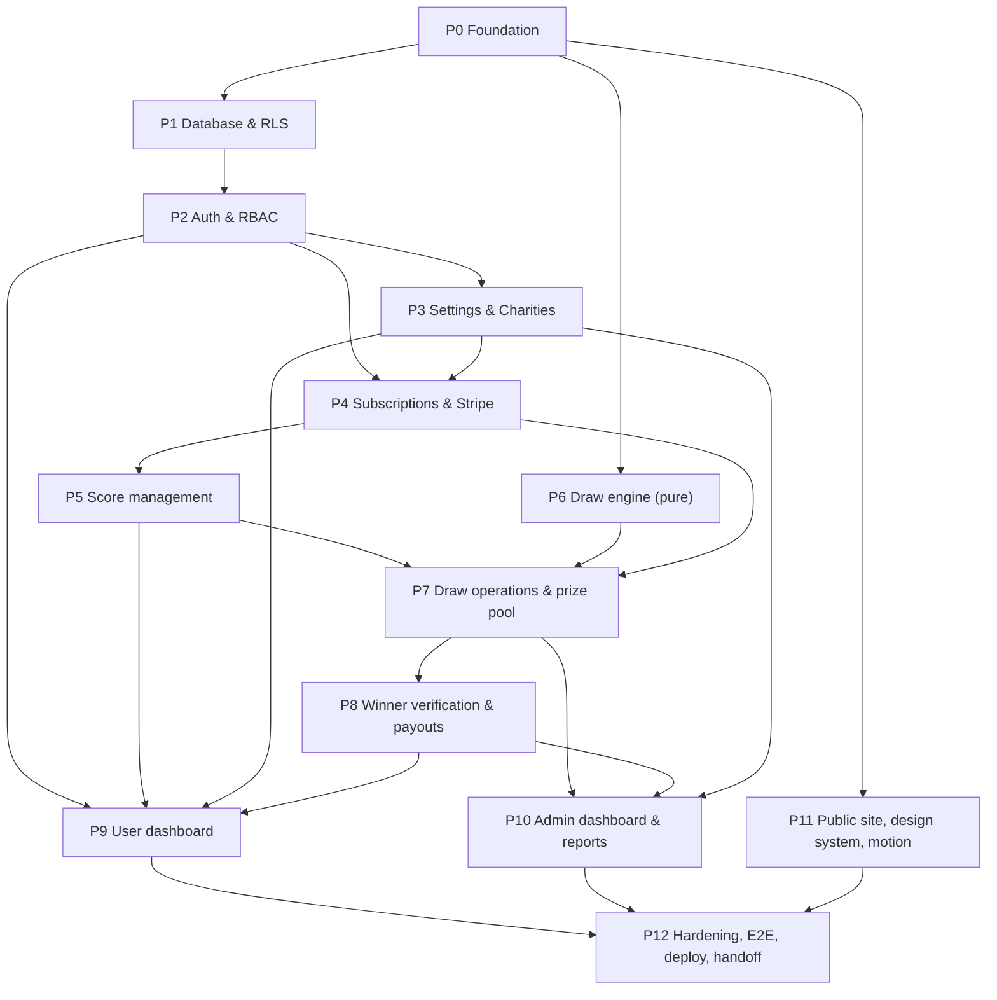

# IMPLEMENTATION_PLAN.md

**Revision 2 (post gap-check).** See §8 (traceability), §9 (change log) and §10 (final roadmap).

Companion to `PRD_ANALYSIS.md`, `ARCHITECTURE.md`, `DATABASE.md`, `DECISIONS.md`. **No application code has been written.** This plan is what I will execute after your go-ahead.

The PRD gives **no timeline**, so phases are sized relatively (S / M / L), not in days.

## 0. Gate: confirmations needed before Phase 0

Ten decisions marked 🔴 in `DECISIONS.md` change numbers or behaviour. I will proceed with the stated defaults if you say "go", but these are the ones worth a glance:

| ID | Question | Default I will use |
|---|---|---|
| D-01 | Can you provide the missing PRD page 11 (§13 Technical requirements, §14 Scalability)? | Proceed without; reconcile if supplied |
| D-03 | Plan prices / yearly discount / currency | ₹499 / ₹4,999, INR (placeholders) |
| D-07 | What non-subscribers may do | Login, profile, charity, subscribe, donate, claim past wins; no scores/draws |
| D-10 | Backdated score older than all 5 | Reject |
| D-14 | Draw numbers vs user scores | 5 drawn numbers (1–45) matched against the user's 5 scores |
| D-17 | Algorithmic bias | Frequent scores weighted higher (switchable) |
| D-22 | Prize-pool % of subscription | 50 % placeholder |
| D-25 | What "unclaimed" jackpot means | No 5-match winner at publish; rejected/never-claimed winners do **not** roll it over |
| D-27 | Max charity % | 50 % |
| D-32 | Rejected proof | Re-upload up to 3 attempts |

## 1. Phase overview & dependencies

Parallelisable: **P6** (pure engine) can start right after P0; **P11 design tokens/components** can start after P0 and finish last.

## 2. Phases

### P0 — Foundation (S)
**Goal:** repo, tooling, and *new* cloud projects ready.
- Create **new Vercel account/project** and **new Supabase project** (PRD §15.1); new Stripe account/test mode.
- Next.js + TypeScript + Tailwind + Framer Motion; ESLint (with import-boundary rules), Prettier, Vitest, Playwright, Husky/CI.
- `env.ts` validation, `.env.example`, `lib/errors.ts`, `lib/money.ts`, `lib/dates.ts`, `lib/logger.ts`.
- **Files:** `package.json`, `tsconfig.json`, `.eslintrc`, `.env.example`, `src/lib/*`, `.github/workflows/ci.yml`, `README.md` (skeleton).
- **Done when:** empty app deploys to Vercel; CI green; env validation fails fast on missing vars.

### P1 — Database & RLS (M)
**Depends on:** P0.
- Migrations `0001`–`0009` per `DATABASE.md` §12; seed for settings/plans/charities.
- Triggers (score rules, `handle_new_user`), RPCs (`publish_draw_atomic`, `record_winner_proof`, `review_winner`, `mark_winner_paid`, report RPCs), RLS policies, storage buckets/policies.
- Generated TS types.
- **Files:** `supabase/migrations/*.sql`, `supabase/seed.sql`, `supabase/tests/*.sql`, `src/types/database.ts`.
- **Tests:** constraint tests (score range, unique date, rolling window under concurrency, min charity %, `paid ⇒ approved`); RLS tests per role (anon / user / other user / admin).
- **Done when:** all constraints and RLS matrix verified against a local Supabase.

### P2 — Authentication & RBAC (S–M)
**Depends on:** P1.
- Supabase clients (browser/server/admin), `middleware.ts`, guards (`requireUser`, `requireAdmin`), login/signup/logout pages, profile settings, role-based redirect, admin seed.
- **Files:** `src/lib/supabase/*`, `src/middleware.ts`, `src/modules/auth/*`, `src/app/(auth)/*`, `src/app/(app)/dashboard/settings/*`.
- **Tests:** signup creates profile; `role` not client-writable; `/admin` blocked for non-admin; unauthenticated redirects.
- **Done when:** PRD checklist item 1 (*signup & login*) passes.

### P3 — Settings & Charities (M)
**Depends on:** P2.
- `settings` module (typed/validated/cached).
- Public **directory** (search + filter), **profile page** (description, images, events), **homepage spotlight** data; admin CRUD (add/edit/delete-archive, media upload, events).
- Charity selection component reused in signup and dashboard.
- **Files:** `src/modules/settings/*`, `src/modules/charities/*`, `src/app/(public)/charities/*`, `src/app/(admin)/admin/charities/*`, `src/components/dashboard/CharityPicker.tsx`.
- **Tests:** percent bounds (10…max) at UI, Zod, DB; archive vs delete rules; search/filter.

### P4 — Subscriptions & Stripe (L)
**Depends on:** P2, P3 (charity choice happens before checkout).
- `PaymentProvider` interface + Stripe adapter; plans; Checkout for monthly/yearly; Customer Portal; webhook route with idempotency; `subscription_payments` writes with charity snapshot; status mapping; `requireSubscriptionState()` on every authenticated request; just-in-time reconcile.
- Independent **donation** flow (`donations`).
- **Lifecycle UI:** status headline *Active / Inactive* + sub-label, renewal date, "cancel / manage plan" via Customer Portal, resubscribe path for lapsed users; checkout refused when a live subscription already exists.
- **Guard placement:** `getViewer()` in every page loader, `withAuth()` in every action/route (not layout-only).
- Test subscriber for evaluators is created through a **real Stripe test checkout** during deployment (D-40); synthetic subscription rows only in test fixtures.
- **Files:** `src/modules/payments/*`, `src/modules/subscriptions/*`, `src/modules/donations/*`, `src/app/api/webhooks/stripe/route.ts`, `src/app/(auth)/subscribe/*`.
- **Tests:** webhook fixtures (created, renewed, failed, cancelled, duplicate, out-of-order); lifecycle mapping table; contribution maths; Stripe test clocks for renewal/lapse; E2E monthly + yearly checkout.
- **Done when:** PRD checklist item 2 passes; status changes apply on next request.

### P5 — Score management (M)
**Depends on:** P4 (subscription gate), P1 (triggers).
- Zod schemas, service, DB-error mapping, server actions, ScoreEditor UI with animated 5-slot window (`ScoreSlot`), edit/delete, newest-first list, **date-collision UX** ("you already have a score for this date — edit it"), admin edit hook.
- **Files:** `src/modules/scores/*`, `src/components/dashboard/ScoreEditor.tsx`, `src/components/motion/ScoreSlot.tsx`.
- **Tests:** 6th score evicts oldest; backdated rejection; duplicate date; boundary values 1/45/0/46; concurrency; lapsed user read-only.
- **Done when:** PRD checklist item 3 passes.

### P6 — Draw engine, pure (M)
**Depends on:** P0 (can run in parallel with P1–P5).
- `rng`, `random`, `weights`, `weighted`, `match`, `pools`, `allocate`, `runDraw`.
- **Files:** `src/modules/draws/engine/*`, `tests/unit/draws/*`.
- **Tests:** deterministic seeds; property tests (5 distinct numbers in 1–45; conservation `poolNew + rolloverIn = prizes + rolloverOut + unallocated`); statistical sanity for weighting; tier/duplicate-value cases; multi-winner split remainders; rollover chains.
- **Done when:** ≥ 95 % branch coverage on the engine; all edge cases in `PRD_ANALYSIS.md` §8 (Draw/prize) covered.

### P7 — Draw operations & prize pool (L)
**Depends on:** P4, P5, P6.
- `DrawService`: snapshot → simulate → publish; `publish_draw_atomic` integration; rollover lookup; chronological + not-future-month rules; **publish blocked unless a simulation exists** (`published_simulation_id`); diff between simulation and publish; admin **Draw console** (mode, config, simulate, compare, publish).
- **Files:** `src/modules/draws/{service,repo,schemas}.ts`, `src/app/(admin)/admin/draws/*`, `src/components/admin/DrawConsole.tsx`, `SimulationDiff.tsx`.
- **Tests:** simulate has no user-visible side effects; double publish / concurrent publish; out-of-order month; **publish without simulation rejected; future month rejected**; AT-01 and AT-05 from `PRD_ANALYSIS.md` §12 as acceptance tests; rollover carried into next draw; RLS: users see only published results.
- **Done when:** PRD checklist item 4 passes; published numbers reproducible from stored snapshot.

### P8 — Winner verification & payouts (M)
**Depends on:** P7.
- Winner claim flow, proof upload to private bucket **via a server route (no direct client storage writes)**, `record_winner_proof`, admin queue (approve/reject with note; **draw-time score snapshot shown beside the screenshot**, D-43), payout **Pending → Paid** with `paid ⇒ approved` guard, resubmission limits.
- **Files:** `src/modules/winners/*`, `src/components/dashboard/ProofUploader.tsx`, `src/components/admin/WinnerQueue.tsx`, `src/app/(admin)/admin/winners/*`.
- **Tests:** file type/size rejection; other users cannot read proofs; state machine transitions; lapsed winner can still claim.
- **Done when:** PRD checklist item 6 passes.

### P9 — User dashboard (M)
**Depends on:** P2, P3, P5, P8.
- The five mandatory modules (PRD §10): subscription status + renewal date; score entry/edit; charity + percentage; participation summary (draws entered, upcoming draws); winnings overview (total won + payment status).
- **Files:** `src/app/(app)/dashboard/*`, `src/components/dashboard/*`.
- **Tests:** each module renders correct data for active / past_due / lapsed / inactive / winner states; PRD checklist item 7.

### P10 — Admin dashboard & reports (L)
**Depends on:** P3, P7, P8.
- User management (view/edit profiles, edit scores, manage subscriptions), draw management (from P7), charity management (from P3), winners management (from P8), **reports & analytics** (total users, total prize pool, charity contribution totals, draw statistics), audit log viewer `[EXT]`.
- **Files:** `src/app/(admin)/admin/*`, `src/modules/reports/*`, `src/components/admin/*`.
- **Tests:** RBAC; report totals reconcile with ledgers (checklist item 9); PRD checklist item 8.

### P11 — Public site, design system, motion (M–L; parallel)
**Depends on:** P0 (tokens) → integrates all.
- Homepage (what user does · how they win · charity impact · persuasive Subscribe CTA), How-it-works (draw mechanics), Pricing (monthly vs yearly), spotlight, motion primitives, responsive layouts, empty/loading/error states, accessibility pass; **micro-interactions across dashboards and admin too** (PRD: *"throughout"*); persistent, prominent **Subscribe** CTA (nav, hero, charity pages, pricing).
- **Files:** `src/app/(public)/*`, `src/components/marketing/*`, `src/components/motion/*`, `tailwind.config.ts`, `src/styles/tokens.css`.
- **Tests:** visual checks at 375 / 768 / 1280; reduced-motion; Lighthouse a11y/perf sanity; checklist item 10.

### P12 — Hardening, E2E, deployment, handoff (M)
**Depends on:** P9, P10, P11.
- Edge-case sweep (`PRD_ANALYSIS.md` §8), security review (RLS, headers, secrets), error-page polish, comment/readability pass (PRD: "well-commented"), seed demo data (incl. past draw with rollover), README (setup, architecture, credentials note), production deploy, smoke test.
- **Done when:** the full PRD testing checklist (§16.1, 11 items) passes on the **deployed** URL.

## 3. Testing strategy

| Layer | Tooling | Focus |
|---|---|---|
| **Unit** | Vitest | draw engine, prize maths, charity %, score rules, status mapping, money helpers |
| **Database** | Supabase CLI + SQL/pgTAP tests | constraints, triggers, rolling window under concurrency, RLS matrix, RPC invariants |
| **Integration** | Vitest + local Supabase | services + repositories, webhook handler with recorded Stripe fixtures, publish transaction |
| **E2E** | Playwright (Chrome + mobile viewport) | full journeys: signup → charity → subscribe (Stripe test card) → scores → (admin) simulate/publish → winner proof → approve → paid |
| **Payments** | Stripe CLI (`listen`, `trigger`), **test clocks**, test cards (success, decline) | renewal, failed payment → past_due, cancel at period end, lapse |
| **Manual** | checklist below | visual/UX, responsive, copy |

**PRD §16.1 checklist ↔ phases**

| # | Item | Phase(s) |
|---|---|---|
| 1 | User signup & login | P2 |
| 2 | Subscription flow (monthly and yearly) | P4 |
| 3 | Score entry — 5-score rolling logic | P5 |
| 4 | Draw system logic and simulation | P6, P7 |
| 5 | Charity selection and contribution calculation | P3, P4 |
| 6 | Winner verification flow and payout tracking | P8 |
| 7 | User dashboard — all modules functional | P9 |
| 8 | Admin panel — full control and usability | P10 |
| 9 | Data accuracy across all modules | P6, P10, P12 |
| 10 | Responsive design on mobile and desktop | P11, P12 |
| 11 | Error handling and edge cases | all; swept in P12 |

**CI (every PR):** typecheck → lint (boundary rules) → unit → DB tests → integration → build. **E2E** runs on preview deployments and before release.

## 4. Deployment strategy (PRD §15, §15.1)

1. **Accounts:** create a **new Vercel** account/team and a **new Supabase** project (not personal/existing); Stripe in **test mode**.
2. **Database:** apply `supabase/migrations/*` then `seed.sql` to the new project; verify RLS enabled on all tables; create storage buckets.
3. **Stripe:** create monthly/yearly Products & Prices; add webhook endpoint `https://<deployment>/api/webhooks/stripe` subscribed to the events in `ARCHITECTURE.md` §8.3; copy signing secret.
4. **Vercel env vars** (Production + Preview): all variables in `ARCHITECTURE.md` §13; service-role and Stripe secrets **server-only**; `NEXT_PUBLIC_SITE_URL` set to the live URL.
5. **Deploy** from the repository; run smoke test (health check, login, public pages, Stripe test checkout, webhook receipt).
6. **Create credentials:** run the seed script for the **admin** and the **test subscriber** (account + 5 scores); then subscribe the test subscriber through a **real Stripe test-mode checkout** so the subscription is genuinely webhook-synced (D-40). Record credentials in the submission note (not in git) and document the Stripe test card in the README.
7. **Verify deliverables:** live URL public ✔ · user panel functional ✔ · admin panel functional ✔ · DB connected with proper schema ✔ · clean, well-commented source ✔.
8. **Rollback:** Vercel instant rollback; migrations forward-only with a documented manual revert for each.

## 5. Deliverables checklist (PRD §15)

| Deliverable | Where it comes from |
|---|---|
| Live website (public URL) | P12 deploy |
| User panel + test credentials | P2–P9 + seed |
| Admin panel + admin credentials | P10 + seed |
| Database (Supabase, proper schema) | P1 migrations |
| Source code (clean, structured, well-commented) | whole repo; README + `docs/` |

## 6. Risk register

| Risk | Impact | Mitigation |
|---|---|---|
| Missing PRD §13/§14 | Unknown mandated stack/targets | D-01: flag, proceed on PRD-stated constraints, reconcile on receipt |
| Stripe API version differences (period/invoice fields moved in newer versions) | Broken webhook parsing | Pin API version; fixture-based webhook tests; JIT reconcile fallback |
| Stripe live-mode availability by country | Cannot take real payments | Test mode for deliverable; provider interface (D-04) |
| Ambiguous prize-pool % / prices | Wrong figures shown | Placeholders in `platform_settings`; confirm before release (D-03, D-22) |
| Concurrency (double publish, racing score inserts) | Data corruption | Row locks, advisory locks, unique indexes, transactional RPC |
| RLS mistakes leaking data | Privacy | RLS test matrix per role in P1 and P12 review |
| Scope creep from `[EXT]` items | Time | `[EXT]` items isolated (audit log, a11y target); droppable |
| Regulatory nature of paid-entry draws (D-42) | Legal exposure in real launch | Out of scope for assignment; noted |

## 7. Working agreements during implementation

- One phase = one PR series; each ends with its tests green and docs updated.
- Any new ambiguity discovered while coding is **added to `DECISIONS.md` first**, then implemented.
- No PRD feature is deferred silently; anything not built is listed with reason in `README.md`.
- `[EXT]` work only after the PRD's mandatory scope is complete.

## 8. Gap check against the original PRD (Rev 2)

### 8.1 The 25-point audit

Legend: ✅ present and correct · 🔧 defect or gap found and fixed in Rev 2.

| # | Item | Where it lives | Verdict | Finding / fix |
|---|---|---|---|---|
| 1 | Subscription lifecycle | BR-04, FR-SUB-03/04, AT-04, D-06 · P4 | 🔧 | State map omitted `incomplete`; a unique "live subscription" index could make webhooks fail permanently → removed, app guard instead; cancel/renew/resubscribe UI made explicit |
| 2 | Real-time subscription validation | BR-05, FR-SUB-05, D-05 · P4, P1 | 🔧 | Check was described as "middleware + actions" — layouts don't re-render on client navigation; now `getViewer()` in every page loader + `withAuth()` in every action/route, plus RLS real-time check on writes |
| 3 | 5-score rolling logic | BR-06/09/10, AT-02, D-10 · P1, P5 | ✅ | DB trigger + advisory lock. D-10 (backdated) stays 🔴 with alternatives documented |
| 4 | One score per date | BR-11 · P1, P5 | 🔧 | `UNIQUE(user_id, played_on)` was right; added the "edit existing" UX the PRD note implies |
| 5 | 1–45 Stableford validation | BR-07 · P1, P5 | ✅ | DB `CHECK` + Zod + boundary tests (0, 1, 45, 46, decimal) |
| 6 | Random vs algorithmic | BR-12, D-16/17 · P6 | 🔧 | PRD calls these **DRAW LOGIC**, not "draw types" — terminology fixed |
| 7 | Simulation before publishing | BR-14, D-20, AT-05 · P7 | 🔧 | **Real gap:** the state machine allowed `draft → published`. Now publish requires a simulation (`published_simulation_id`, RPC check, `DRAW_NOT_SIMULATED`) |
| 8 | 5/4/3-number match tiers | BR-13, D-14/15 · P6 | 🔧 | PRD calls these **DRAW TYPES** — terminology fixed |
| 9 | 40/35/25 distribution | BR-16, AT-01 · P6 | 🔧 | PRD says *pre-defined and enforced automatically* — shares were in an admin-writable table; now read-only at runtime (D-45) |
| 10 | Jackpot rollover | BR-19, D-25, AT-01 · P6, P7 | 🔧 | "Unclaimed" has two readings; D-25 upgraded to 🔴 with the alternative spelled out; worked example added |
| 11 | Multiple-winner equal split | BR-18, AT-01 · P6 | ✅ | `floor(pool/winners)`; remainder → rollover; conservation invariant tested |
| 12 | Active-subscriber pool calculation | BR-17, D-22/23, AT-01 · P6, P7 | ✅ | Worked example added; fee basis (plan price vs invoice ex-tax) documented |
| 13 | Charity minimum 10 % | BR-21 · P1, P3, P4 | ✅ | UI + Zod + DB `CHECK` on `profiles` and `subscription_payments` |
| 14 | User-adjustable contribution | BR-22, D-28, AT-03 · P3, P9 | 🔧 | Snapshot was ambiguous between checkout metadata and profile → now always the profile's **current** value at invoice time |
| 15 | Winner proof upload | BR-25, D-33/43 · P8 | 🔧 | "Golf platform" undefined → D-43; uploads made server-mediated (no direct client storage insert) |
| 16 | Admin verification | BR-26 · P8 | 🔧 | Reviewer now sees the draw-time score snapshot beside the screenshot |
| 17 | Pending → Paid flow | BR-27, D-32 · P8 | ✅ | Exact PRD states; `paid ⇒ approved` `CHECK` |
| 18 | User dashboard | §6.7 · P9 | 🔧 | PRD shows *active / inactive*; headline now exactly that, richer state as sub-label |
| 19 | Admin dashboard | §6.8 · P10 | ✅ | All 5 surfaces and every listed capability mapped |
| 20 | Reports and analytics | FR §6.8 row 05, D-36 · P10 | ✅ | 4 named reports via admin-only RPCs; reconciliation tests |
| 21 | RLS / security | DATABASE §9 · P1, P12 | 🔧 | Note: the PRD does **not** mention RLS — it's an engineering choice (Supabase best practice, tagged `[ASSUMPTION]`). Fixed: settings write path, storage direct-insert, winners' identities via `published_draw_results()` only, charity must be active |
| 22 | Responsive UI | §6.9, NFR-03 · P11, P12 | ✅ | 375 / 768 / 1280 viewport tests |
| 23 | Error handling | NFR-04, ARCH §4.4 · all | 🔧 | Added `DRAW_NOT_SIMULATED`, `DRAW_FUTURE_MONTH`; edge cases for `incomplete` checkout and repeated checkout |
| 24 | Mandatory deployment requirements | §10 · P0, P12 | 🔧 | Test subscriber must come from a real Stripe test checkout (a seeded fake row would be overwritten by reconcile) |
| 25 | Complete testing checklist | §9.1 · §3 above | ✅ | 11 / 11 PRD items mapped to phases and test layers |

### 8.2 Requirement-by-requirement traceability

| PRD § | Requirement | Analysis ref | Phase | Verified by |
|---|---|---|---|---|
| §01 | Subscription-driven app: tracking + charity + draws | §2, F-01 | P11, P12 | full E2E journey |
| §01 | Emotion-led; not a traditional golf site | §6.9 | P11 | design review, visual checks |
| §01.1 | Subscribe monthly/yearly | F-03/04 | P4 | E2E (checklist 2) |
| §01.1 | Enter Stableford scores | F-07 | P5 | unit + E2E (3) |
| §01.1 | Participate in monthly prize pools | F-10–15 | P6, P7 | engine + E2E (4) |
| §01.1 | Support a charity with a portion of fee | F-16 | P3, P4 | unit + integration (5) |
| §03 | Public visitor: concept, charities, draw mechanics, initiate subscription | §4 | P3, P11 | E2E as anonymous |
| §03 | Subscriber: profile, scores, charity, participation/winnings, proof | §4 | P2, P5, P8, P9 | E2E, RLS tests |
| §03 | Administrator: users/subscriptions, draws, charities, winners/payouts, reports | §4 | P10 | RBAC + E2E (8) |
| §04 | Monthly and yearly (discounted) plans | BR-01 | P4 | E2E both plans |
| §04 | Stripe / PCI provider | BR-02 | P4 | hosted Checkout; no card data stored |
| §04 | Restricted access for non-subscribers | BR-03, D-07 | P4, P5 | gate tests |
| §04 | Renewal, cancellation, lapsed | BR-04, AT-04 | P4 | webhook fixtures + test clocks |
| §04 | Real-time status check every authenticated request | BR-05 | P4, P1 | guard tests + RLS test |
| §05 | Last 5 scores; range 1–45; dated; latest 5 retained; new replaces oldest; newest first; one per date | BR-06–11, AT-02 | P1, P5 | DB + unit + E2E (3) |
| §06 | Draw logic: random / algorithmic | BR-12 | P6 | seeded + statistical tests |
| §06 | Draw types: 5/4/3-number match | BR-13 | P6 | unit |
| §06 | Monthly cadence; admin publishes; simulation first; jackpot rollover | BR-14, AT-05 | P7 | integration + E2E (4) |
| §07 | Fixed portion, pre-defined, automatic | BR-15, D-45 | P6, P7 | engine + config tests |
| §07 | 40 / 35 / 25 shares | BR-16, AT-01 | P6 | unit |
| §07 | Pool from active subscriber count | BR-17, AT-01 | P6, P7 | unit + integration |
| §07 | Equal split among same-tier winners | BR-18 | P6 | unit (incl. remainders) |
| §07 | 5-match jackpot carries forward | BR-19 | P6, P7 | multi-month integration |
| §08.1 | Choose charity at signup | BR-20 | P2, P3 | E2E |
| §08.1 | Minimum 10 % | BR-21 | P1, P3, P4 | DB + unit (AT-03) |
| §08.1 | Voluntary increase | BR-22 | P3, P9 | unit + E2E |
| §08.1 | Independent donation | BR-23 | P4 | E2E donation |
| §08.2 | Directory with search & filter; profiles with images/events; homepage spotlight | FR-CH-05–07 | P3, P11 | E2E |
| §09 | Winners only; screenshot proof; approve/reject; Pending → Paid | BR-24–27 | P8 | E2E (6), RLS |
| §10 | Five dashboard modules | §6.7 | P9 | E2E (7) |
| §11 | Five admin surfaces (incl. edit scores, run simulations, manage media, reports) | §6.8 | P3, P7, P8, P10 | E2E (8, 9) |
| §12 | Feel, avoid, homepage content, animations, prominent CTA | §6.9 | P11 | visual/manual (10) |
| §13 / §14 | **Missing from supplied PDF** | §0, D-01 | reconcile on receipt | — |
| §15 | Live URL, user + admin panels with credentials, DB, source code | §10 | P12 | deployed smoke test |
| §15.1 | New Vercel, new Supabase, env vars | §10 | P0, P12 | deployment checklist |
| §16 / §16.1 | 6 criteria; 11-item testing checklist | §9 | all | §3 mapping |

## 9. Rev 2 change log

| Doc | Change |
|---|---|
| `PRD_ANALYSIS.md` | Draw logic vs draw types terminology; simulation-before-publish made explicit; "pre-defined" distribution (D-45); dashboard active/inactive rule; score-date collision UX; admin proof review with snapshot; new edge cases; **worked acceptance examples AT-01…AT-05**; PRD section coverage table; document-numbering observations |
| `DECISIONS.md` | D-05, D-06, D-18, D-20, D-21, D-22, D-40 revised; **D-25 upgraded to 🔴**; **D-43** (golf platform), **D-44** (notifications), **D-45** (pre-defined distribution) added; settings registry marked non-UI-editable |
| `DATABASE.md` | Unique live-subscription index removed; `published_simulation_id` + check; `publish_draw_atomic` takes `simulation_id`; `platform_settings` read-only; storage: no direct client insert; `published_draw_results()`; charity must be active; seed guidance |
| `ARCHITECTURE.md` | Guard placement; charity snapshot source; lifecycle diagram without `draft → published`; new error codes; read-only config; middleware scope |
| `IMPLEMENTATION_PLAN.md` | 🔴 list now ten; P4/P5/P7/P8/P11 tasks and tests extended; deployment step 6 corrected; §8–§10 added |

## 10. Final implementation roadmap (Rev 2)

**Definition of ready:** the ten 🔴 defaults in §0 are accepted (or overridden), and page 11 of the PRD is either supplied or knowingly skipped.

| Order | Phase | Outcome | Exit gate |
|---|---|---|---|
| 1 | **P0 Foundation** | Repo, tooling, new Vercel + Supabase + Stripe test account, env validation | Empty app deployed; CI green |
| 2 | **P1 Database & RLS** | Migrations, triggers, RPCs, policies, buckets, seed | Constraint + RLS test matrix passes |
| 3 | **P2 Auth & RBAC** | Signup/login, guards, admin seed | Checklist 1 |
| 4 ∥ | **P6 Draw engine** *(parallel from P0)* | Pure engine + AT-01/AT-05 logic | ≥ 95 % branch coverage |
| 5 | **P3 Settings & Charities** | Directory, profiles, events, spotlight data, admin CRUD | Percent bounds tested |
| 6 | **P4 Subscriptions & Stripe** | Checkout, webhooks, lifecycle, per-request guard, donations | Checklist 2; lifecycle tests |
| 7 | **P5 Scores** | Rolling window, one-per-date, animated slots | Checklist 3; AT-02 |
| 8 | **P7 Draw operations** | Simulate → publish (atomic), pool, rollover | Checklist 4; AT-01, AT-05 |
| 9 | **P8 Winners** | Proof upload, review, Pending → Paid | Checklist 6 |
| 10 | **P9 User dashboard** | Five mandatory modules | Checklist 7 |
| 11 | **P10 Admin dashboard & reports** | Five surfaces + reports | Checklist 8, 9 |
| 12 ∥ | **P11 Public site & motion** *(tokens from P0, finished late)* | Homepage, how-it-works, pricing, motion, responsive | Checklist 10 |
| 13 | **P12 Hardening & deployment** | Edge-case sweep, security review, comments, README, deploy, credentials | All 11 checklist items pass on the **live URL** |

**Rules of engagement:** every new ambiguity goes into `DECISIONS.md` before code; nothing in the PRD is deferred silently; `[EXT]` work only after mandatory scope; no phase closes with failing tests.
